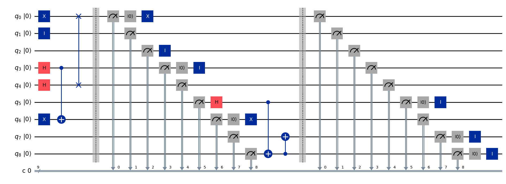

# Interactive Showcase of Quantum Computing Concepts

This repository contains my submissions for **2 assignments** in the **Introduction to Quantum Computing** subject at the **University of Technology Sydney** (UTS) taught by [Dr. Christopher Ferrie](https://profiles.uts.edu.au/Christopher.Ferrie) and [Dr. Christina Giarmatzi](https://profiles.uts.edu.au/Christina.Giarmatzi). 

Each assignment is done using IBM [Qiskit](https://github.com/Qiskit/qiskit) along with a **Google Colab** notebook, which includes a detailed implementation and explanation of the quantum concepts involved in a fun and interactive way.

## [Assignment ∣01⟩ ⚛ Quantum Tic-Tac-Toe game ⚛](./assignment1_quantum_tictactoe/)

> Demo: https://www.youtube.com/watch?v=U6_wSh_-EQc

This is an enhanced version of the traditional Tic-Tac-Toe, incorporating elements of quantum mechanics, such as *quantum gates*, *superposition*, *entanglement*, etc., to add depth and complexity to the strategic gameplay.

Here, I demonstrated the game rules, my **fair play mechanisms**, as well as its **measurement** and **collapse** processes. I also provided examples of movement operations, mainly focusing on the quantum aspects, such as *entanglement* and its associated **risk levels**.

👉 For more details, check the [`assignment1_quantum_tictactoe`](./assignment1_quantum_tictactoe) folder.

## [Assignment ∣02⟩ 🔐 Shor's Algorithm 🔐](./assignment2_shor_algorithm/)

This is an implementation of the Shor's algorithm, a quantum algorithm for integer factorization. It is divided into 2 main parts:

**1. Classical Part**: This involves reducing the problem of factorizing an integer $N$ to the problem of finding the period $r$ of a specific function.

**2. Quantum Part**:
- This involves using a quantum computer to **find the period $r$** efficiently. The algorithm creates a *superposition* of states to encode information about the period into the quantum state.
- The **Quantum Fourier Transform** (QFT) is applied to the quantum state to extract the period $r$:

    $$\left| \tilde{x} \right\rangle = QFT_N \vert x \rangle = \frac{1}{\sqrt{N}} \sum_{k=0}^{N-1}  e^{2\pi i \frac{xk}{N}} \vert k \rangle$$
    $$\text{where N = number of qubits; } \vert k \rangle = \vert k_1 k_2 \cdots k_n \rangle (\text{binary qbuit state })$$

 - This is a series of **Hadamard** and **Controlled Phase Rotation** gates to the output state of the **Modular Exponentiation** circuit. This transforms the state into a form where measuring the qubits can yield the period $r$ (just a change of basis).
 - This **Modular Exponentiation** is crucial for creating the periodic function. It involves applying a series of **controlled-U** gates, where $U$ represents modular multiplication.

👉 For more details, check the [`assignment2_shor_algorithm`](./assignment2_shor_algorithm) folder.

